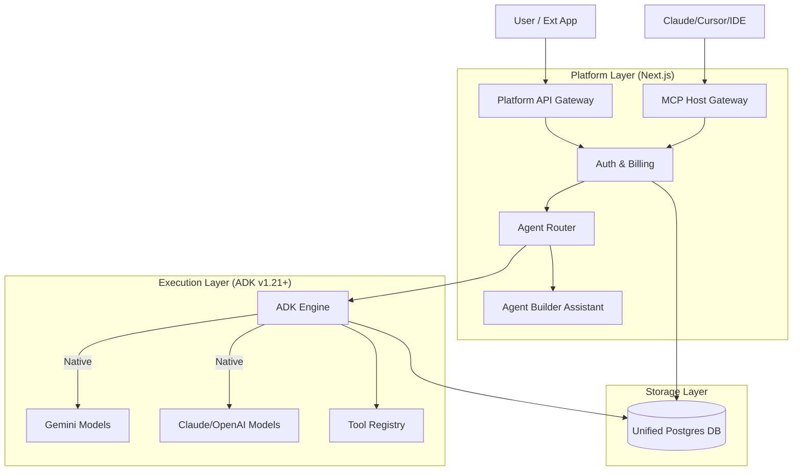

# Platform Evolution Plan: The Universal Agent Platform

**Date:** December 15, 2025
**Status:** Strategic Roadmap
**Supersedes:** `STRANGLER_FIG_MIGRATION.md`
**Goal:** Transform the Admin Tool into a multi-tenant, API-first Universal Agent Platform powered by Google ADK v1.21+ and exposed via MCP.

---

## 1. Strategic Pivot: Embrace & Extend ADK

Instead of replacing Google ADK (Strangler Fig), we will **upgrade and wrap it**. Recent ADK releases (v1.20+) have introduced native multi-model support (Claude/LiteLLM), session rewinds, and parallel execution, solving our core infrastructure needs.

Our focus shifts from *building an engine* to *building the platform layer* around that engine: security, billing, external APIs, and a "Meta-MCP" interface.

---

## 2. Target Architecture

---

## 3. Implementation Phases

### Phase 1: Foundation Upgrade (The "Upgrade Plan")
**Goal:** Modernize the engine and own the data.

1.  **Upgrade ADK Docker:** Bump `google-adk` to `v1.21+` in `adk-service/Dockerfile`.
2.  **Unify Storage:** Configure ADK to write to the main PostgreSQL instance (replacing SQLite).
    *   *Action:* Update `adk-service` launch scripts to use `SESSION_SERVICE_URI=postgresql://...`.
    *   *Action:* Map ADK tables to Next.js via Prisma/SQL Views for the UI.
3.  **Enable Multi-Model:** Configure ADK's new `LiteLLM` provider to support Anthropic and OpenAI models within the existing YAML structure.

### Phase 2: The "Meta-MCP" Layer
**Goal:** Everything is an MCP server.

1.  **Outbound MCP (Agents as Tools):**
    *   [x] Create a dynamic MCP endpoint (`/api/mcp/agents`) that exposes *every* built agent as a tool. (Completed)
    *   *Use Case:* User in Cursor/Claude Desktop can connect to this URL and say "Ask the Research Agent to find X".
2.  **Inbound MCP (Builder as Tool):**
    *   [x] Expose the **Agent Builder** itself as an MCP tool. (Completed via `/api/agents/[name]/assistant`)
    *   *Tool:* `create_agent(name, prompt, tools)`
    *   *Tool:* `add_tool_to_agent(agent_name, tool_def)`
    *   *Use Case:* An external "Architect Agent" can programmatically build and deploy new agents on our platform.

### Phase 3: Dynamic Tool Factory (In Progress)
**Goal:** "Just-in-Time" Tool Creation using Advanced Coding Agents.

1.  [x] **The "Meta-Agent" Architecture (Dogfooding):** (Completed Dec 18, 2025)
    *   **Concept:** Migrate the hardcoded "Builder Assistant" to be a genuine ADK Agent (`builder_agent.yaml`) running on the engine itself.
    *   **Why:** Allows using the Visual Builder to improve the Builder, enables evaluations, and visual debugging of the building process.
    *   **Safety:** Deploy this agent to a protected `system_core/` namespace to prevent it from accidentally modifying its own definition ("Lobotomy Risk") and locking users out.
2.  [x] **Genkit as the Tool Layer:** (Completed Dec 18, 2025)
    *   Use Google Genkit to implement the robust *infrastructure tools* (`create_agent`, `write_file`, `run_shell`) that the Meta-Agent calls.
    *   Implement a minimal "Rescue Agent" in Genkit as a fallback if the ADK engine fails.
3.  **The "Forge" Sub-Agent:**
    *   Create a specialized "Tool Maker" agent.
    *   **Integration:** Add this as a *sub-agent* to the Builder Meta-Agent.
    *   *Workflow:* User asks Builder for a stock tool -> Builder delegates to Forge -> Forge writes `get_stock_price.py` -> Builder registers it.
4.  **Tool Registry UI:** A dedicated section in the Visual Builder to manage custom tools.
5.  **Hot Reloading:** Ensure ADK picks up new tools without a full restart (or seamless restarts).

### Phase 4: True Platform Infrastructure (The "Real" Backend)
*   [x] **4.1 Dedicated Database:** Provision `goforgeit-db` Cloud SQL instance and configure `app.goforgeit.com` to use it. (Completed Dec 16, 2025)
**Goal:** Turn the internal tool into a SaaS-ready platform.

1.  **Organization/Project Scope:** Move from a flat agent list to `Organization > Project -> Agent` hierarchy.
2.  **Token Accounting:**
    *   Intercept ADK streams in the Next.js Router.
    *   Count tokens per request.
    *   Log usage to `billing_ledger` table linked to the User/Org.
3.  **API Keys:** Issue API Keys for external apps to call `POST /api/run`.

### Phase 4.5: The Visible Platform (Completed Dec 17, 2025)
**Goal:** Expose the infrastructure to the user with a secure, multi-tenant UI.

1.  **Project Hierarchy:** Refactored architecture to `Organization > Project (Folder) > Agent`.
2.  **Billing Dashboard:** Created `/settings/billing` with granular cost breakdown (by Project/Agent/Model), input/output token tracking, and visual usage trends.
3.  **Security:** Enforced "One User = One Organization" model with auto-provisioning (`ensureUserOrg`) and strict API auth checks.
4.  **Pricing Engine:** Centralized pricing logic (`lib/pricing.ts`) supporting Gemini 3.0, GPT-5.2, and other future models.

### Phase 5: UX Revolution
**Goal:** A chat interface that feels like an OS.

1.  **MCP UI:** When an agent returns a "Tool Call", render a dedicated UI component (e.g., a stock chart, a map, a form) instead of just JSON.
2.  **Scheduling:** "Run this agent every morning at 9 AM." -> Write to a `cron_jobs` table -> Trigger ADK via API.
3.  **Stream Protocol:** Standardize the SSE stream to support "Thought Chains", "Tool Status", and "Final Answer" as distinct UI elements.

---

## 4. Immediate Next Steps

1.  [x] **Execute Phase 1:** Upgrade Dockerfile and switch DB to Postgres. (Completed Dec 15, 2025)
2.  [x] **Prototype Phase 2:** Build a simple MCP server endpoint in Next.js that wraps one hardcoded agent. (Completed Dec 15, 2025)
3.  [x] **Design Phase 4 DB:** Sketch the schema for `organizations`, `projects`, and `billing_ledger`. (Completed Dec 16, 2025)
4.  [x] **Implement Phase 4 & 4.5:** Full billing infrastructure, dashboard, and project hierarchy. (Completed Dec 17, 2025)
5.  [x] **Start Phase 3 Refactor:** Port the Builder Assistant's hardcoded loop to Genkit tools and create the `builder_agent.yaml`. (Completed Dec 18, 2025)
6.  [ ] **Implement Forge Sub-Agent:** Create the specialized tool-maker agent and integrate it with the Builder Meta-Agent.
